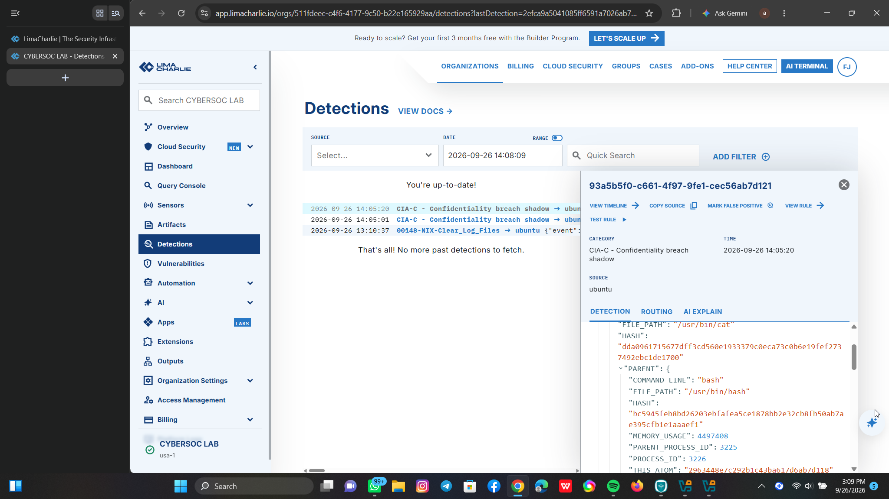
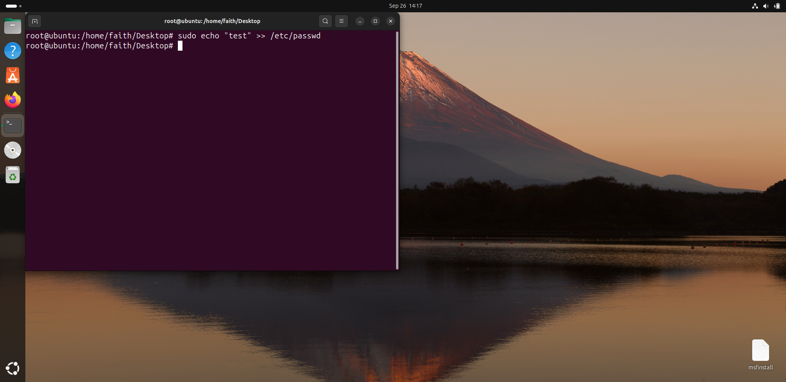
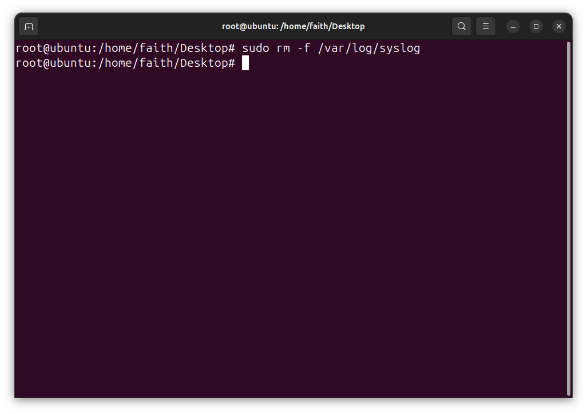

# CIA Triad - LimaCharlie Detection Lab | CYBERSOC LAB

> Simulated CIA Triad attacks on Ubuntu VM and detected in real-time using LimaCharlie EDR.

This lab demonstrates practical understanding of **Confidentiality, Integrity, and Availability** attacks and how a modern SOC detects them.

### 🎯 Lab Objective
To simulate real-world attacks violating the CIA triad and validate detections using LimaCharlie Cloud EDR.

### 🖥️ Lab Environment
- **Victim:** Ubuntu 22.04 LTS (VMware / VirtualBox) on Host OS Windows
- **EDR:** LimaCharlie Sensor + Cloud
- **Attacker:** Ubuntu Terminal (Local simulation)
- **Analyst:** CYBERSOC LAB - LimaCharlie Dashboard

### 🔴 Attacks Simulated

**1. Availability Test (A):**
Simulated resource exhaustion / system disruption commands to test system availability monitoring.
- Proof: `ubuntu-availability-test.png`

**2. Integrity Test (I):**
Simulated log tampering / file modification attempt (Clear_Log_Files) - violates data integrity.
- Proof: `ubuntu-integrity-test.png`

**3. Confidentiality Test (C):**
Simulated confidential file access / breach attempt (shadow file access).
- Detection Rule Triggered: `CIA-C - Confidentiality breach - shadow`
- Proof: `limacharlie-detections.png`

### 📸 Detection Proofs

#### 1. LimaCharlie Detections Dashboard
This is the main SOC evidence - LimaCharlie detected all 3 CIA violations from my Ubuntu sensor.

#### 2. Ubuntu Availability Test
Terminal evidence of availability attack simulation.

#### 3. Ubuntu Integrity Test
Terminal evidence of integrity attack simulation (log/file tamper).

### 🛡️ MITRE ATT&CK Mapping
- **T1003.008** - OS Credential Dumping: /etc/shadow
- **T1070.001** - Clear Linux Logs
- **T1496** - Resource Hijacking / Availability Impact

### 🔧 Tools Used
- LimaCharlie EDR
- Ubuntu Linux
- VMware Workstation
- Git & GitHub for Documentation

### 👩‍💻 Author
**Faith Ademusire** | Aspiring SOC Analyst | CYBERSOC LAB
Built with focus on Blue Team / Detection Engineering.

> This lab is part of my SOC Analyst portfolio - demonstrating hands-on EDR detection and CIA Triad understanding.
